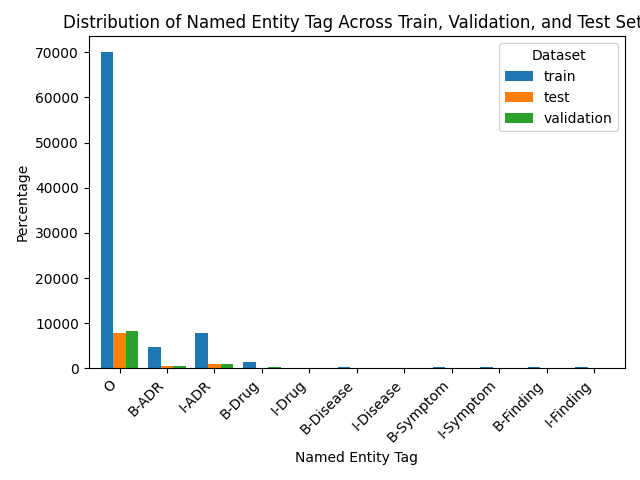
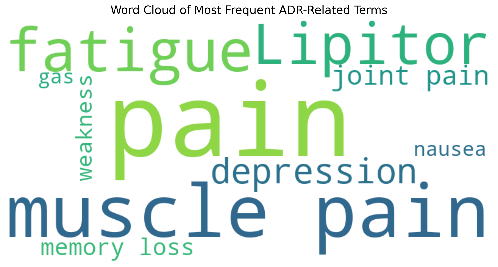

# Project Title

This project is designed to train and evaluate a named entity recognition (NER) model using the Hugging Face Transformers library and PyTorch as well as In-context learning with GPT model. CADEC dataset is used as our starting point to analyse the effectivess of different BERT models considering different evaluation metrics. It includes functionalities for data preprocessing, model training, evaluation, and analysis.

## Getting Started

### Prerequisites

- Python 3.7+
- PyTorch
- Transformers
- Pandas
- Datasets

### Installation

1. Clone the repository:
   ```bash
   git clone git@github.com:NastaranMO/Adverse-Drug-Reaction-NER.git
   ```

2. Navigate to the project directory:
   ```bash
   cd Adverse-Drug-Reaction-NER
   ```

3. Install the required packages:
   ```bash
   pip install -r requirements.txt
   ```

## Usage

### Running the Training

To train the model, use the following command:
```bash
python main.py --mode train --model <model-name>
```

Example:
```bash
python main.py --model medicalai/ClinicalBERT --mode train
```

### Averaging Results Over Multiple Runs

To average the training results over 5 runs, execute:
```bash
python main.py --mode average --model <model-name>
```

### Data Analysis

To perform data analysis:
```bash
python main.py --analysis
```

## Project Structure

- `main.py`: Main script for training and evaluation.
- `utils.py`: Utility functions and argument parsing.
- `gpt.py`: Script for GPT model operations.
- `gpt.neo.py`: Script for GPT-Neo model operations.
- `preprocess_cadec.py`: Script for preprocessing CADEC dataset for the Transformer model.
- `preprocess-generative.py`: Script for data preprocessing for geneartive alnguage models.
- `top_entities_by_category_test`: CSV file containing top entities by category for test set.
- `top_entities_by_category_train`: CSV file containing top entities by category for train set.
- `top_entities_by_category_val`: CSV file containing top entities by category for validation set.


## Results
### Distributions of Tags

### Word Cloud 


## Acknowledgments

- Hugging Face for the Transformers library
- PyTorch for deep learning capabilities
